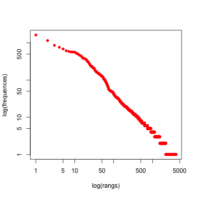
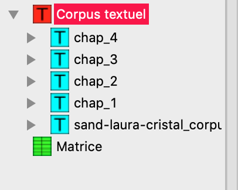
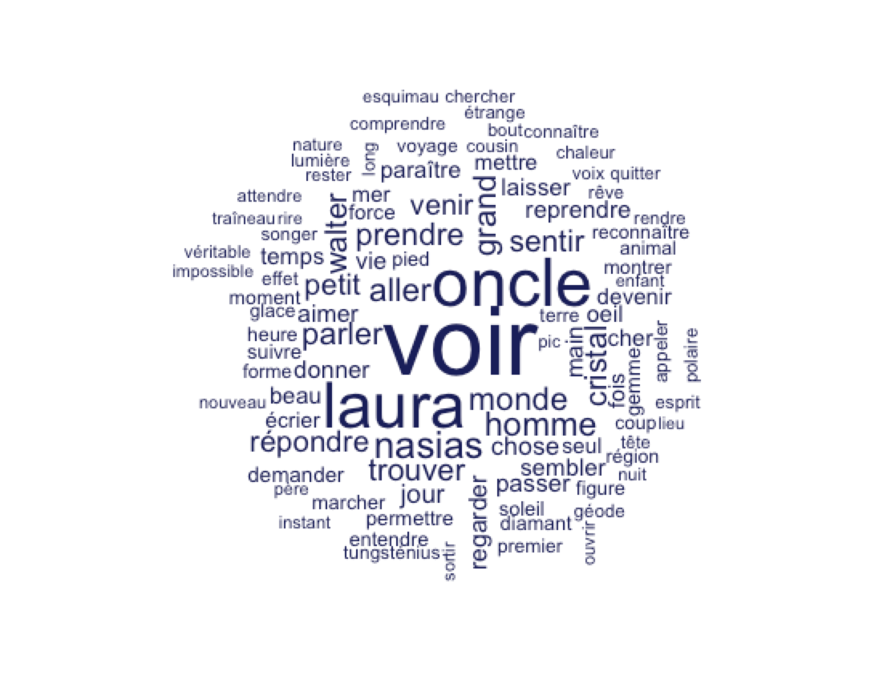
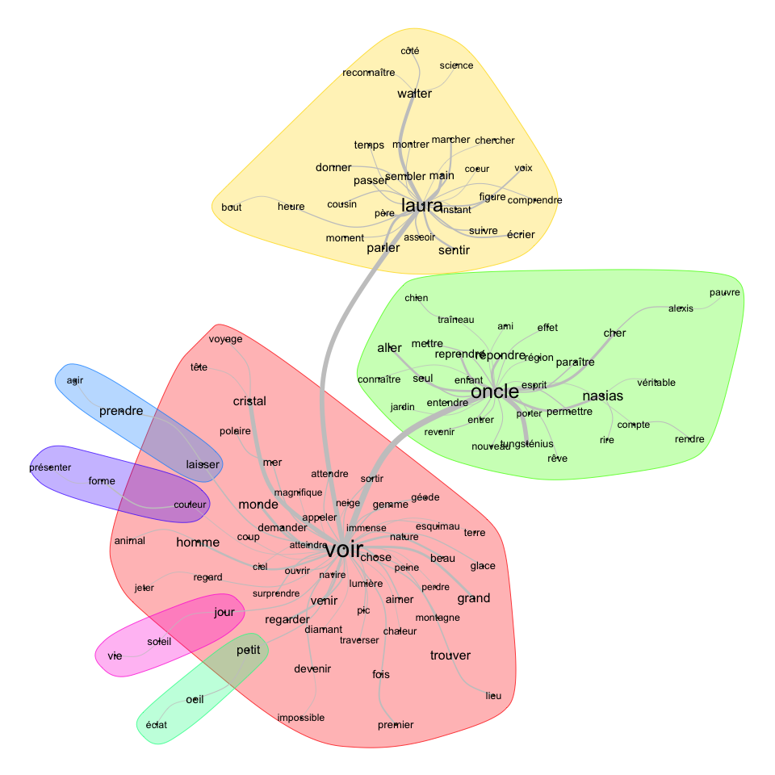
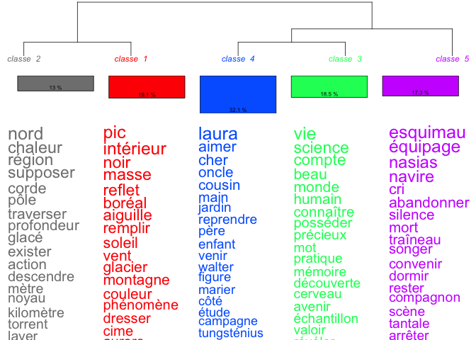
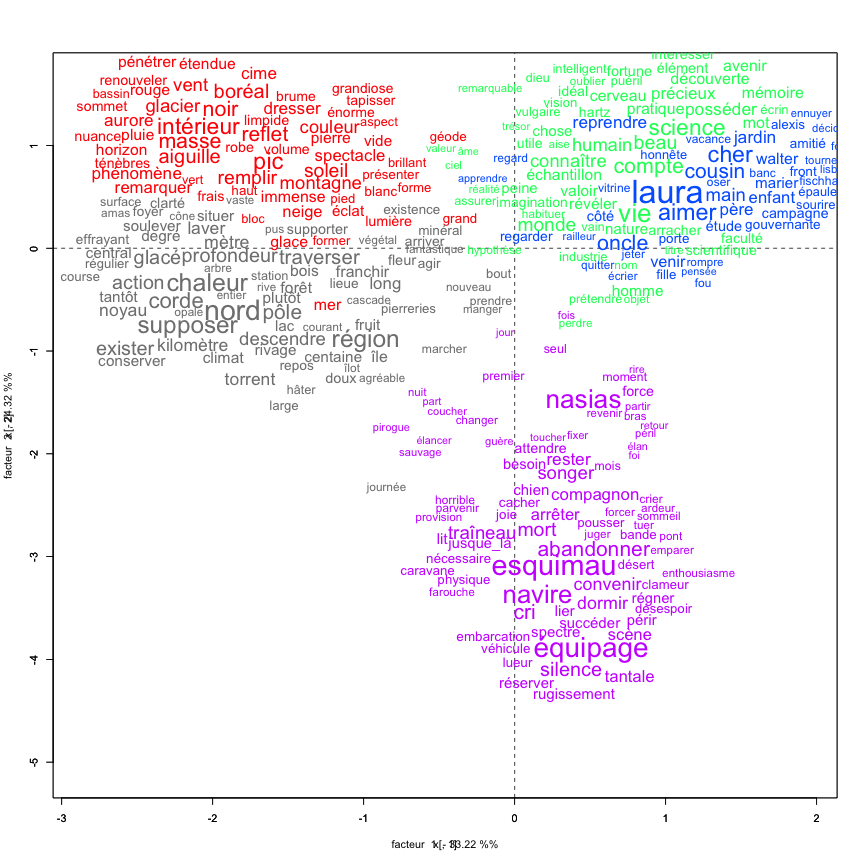
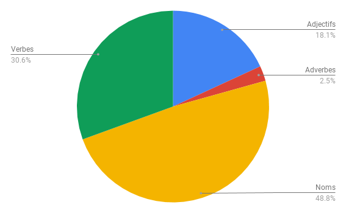

# Analyse d'un texte: George Sand - _Laura, voyage dans le cristal_


## Étape 1: Récupérer le texte et le transformer de manière étudiable

La première étape consiste à récupérer le texte. Par chance, il est disponible et ligne dans le domaine public. J'ai personnellement utilisé [wikisource](https://fr.wikisource.org/wiki/Laura._%E2%80%95_Voyage_dans_le_cristal),  où le texte est disponible en format plein texte ainsi qu'en format pdf.

Une fois le texte récupéré, j'ai pu le formater afin de le rendre étudiable par le logiciel iramuteq. Celui-ci était déjà plutôt correctement formaté sur wikisource, mais j'ai cependant pris le soin d'en faire une relecture minutieuse, ce qui m'a également permis de découvrir cette œuvre bouleversante de George Sand, que je n'avais jamais lue avant cet exercice.

Par chance, ce texte ne comportait que 4 chapitres, qu'il m'a fallu formater. Je les ai formatés avec les balises suivantes.

```
**** *chap_1
**** *chap_2
**** *chap_3
**** *chap_4
```

Puis je l'ai sauvegardé sous le nom **sand-laura-cristal.txt**.
La [documentation d'Iramuteq](http://www.iramuteq.org/documentation/html) m'a été utile à partir de là.

## Étape 2: Utiliser Iramuteq afin d'analyser le texte

### Analyse globale

La première partie de mon analyse va être une analyse **globale** du texte de George Sand. Cette analyse peut être réalisée de plusieurs manières. Soit en :
- Exportant notre donnée obtenue et en l'analysant avec des logiciels de data analyse plus complets
- Utilisant les fonctionalités d'Iramuteq pour analyser les données

#### En utilisant Iramuteq

Iramuteq nous donne les informations suivantes à propos de notre texte :
- Nombre d'occurences: 35484
- Nombre de formes: 4006
- Nombre d'hapax: 1803
- Nombre d'occurences par texte: 8871

Le résumé graphique nous donne le diagramme suivant. Sur une échelle logarithmique, on trouve la fréquence de mots cités sur leurs occurrences. Naturellement, on trouve une forte quantité de mots à peu d'occurrences, ce qui indique la richesse du vocabulaire de l'auteure.


En appliquant des métadonnées dans le texte, nous pouvons également réaliser des analyses uniques par chapitre.



#### Nuage de mots

Une analyse en nuage de mots permet d'avoir une représentation graphique des mots aux occurrences les plus élevées. Cette représentation, bien que visuellement agréable, ne semble pas être très utile dans notre volonté d'analyser un texte de manière plus poussée.



#### Analyses de similitudes

Selon la documentation d'Iramuteq, une analyse de similitudes est 
> une analyse des cooccurrences présentée sous formes de graphiques de mots associés (Figure 25). Les indices de similitudes proposés dans IRaMuTeQ sont ceux disponibles dans la librairie proxy de R (Meyer, Buchta). Cette analyse met en œuvre les concepts de la théorie des graphes utilisés en Analyse des Données Relationnelles.

Une analyse de similitude sur notre œuvre nous donne le graphique suivant :


Il a été possible d'obtenir un graphique lisible après plusieurs essais avec les réglages  de Iramuteq. Chaque grande catégorie est associée à ses concepts similaires trouvés dans le texte.

#### Classification Reinert et AFC

La classification Reinert permet de créer des catégories selon une une classification hiérarchique descendante.



On y distingue des catégories et des classifications qui paraissent plus pertinentes qu'avec les analyses de similitudes. Bien que certains mots aient des classifications douteuses, nous remarquons des grands thèmes d'occurrences comme indiqué plus précisément dans le tableau suivant.

| Classe 1 | Classe 2 | Classe 3 | Classe 4 | Classe 5   |
|----------|----------|----------|----------|------------|
| Chaleur  | Pic      | Laura    | Vie      | Abandonner |
| Glacé    | Montagne | Oncle    | Humain   | Mort       |
| Nord     | Glacier  | Cousin   | Monde    | Cri        |
|          |          | Père     | Science  | Silence    |
|          |          | Enfant   |          | Dormir     |

Une utilisation en AFC nous permet de représenter nos résultats en deux dimensions, ce qui nous indique quelles classes sont similaires à d'autres. Dans notre cas par exemple, on remarque l'exceptionalité de notre **Classe 5**




## Pour aller plus loin

Nous pouvons également utiliser un logiciel de traitement de donnée pour analyser notre donnée exportée.


Ci-dessus une représentation de la nature grammaticale des mots dans l'intégralité du texte. J'ai pour ceci exporté le texte en .csv et utilisé Excel.

## Pour conclure

Une analyse textuelle en utilsant Iramuteq nous permet de remarquer que George Sand a beaucoup fait reposer ce roman sur les sens. Le verbe **voir** est le mot le plus présent dans cet ouvrage, non loin des verbes **sentir**, **regarder**, **entendre**. Ce procédé littéraire est nommé **synesthésie**, c'est-à-dire l'alliance de plusieurs perceptions sensorielles. Dans ce texte, tous sens sont présents mais la vue domine.


